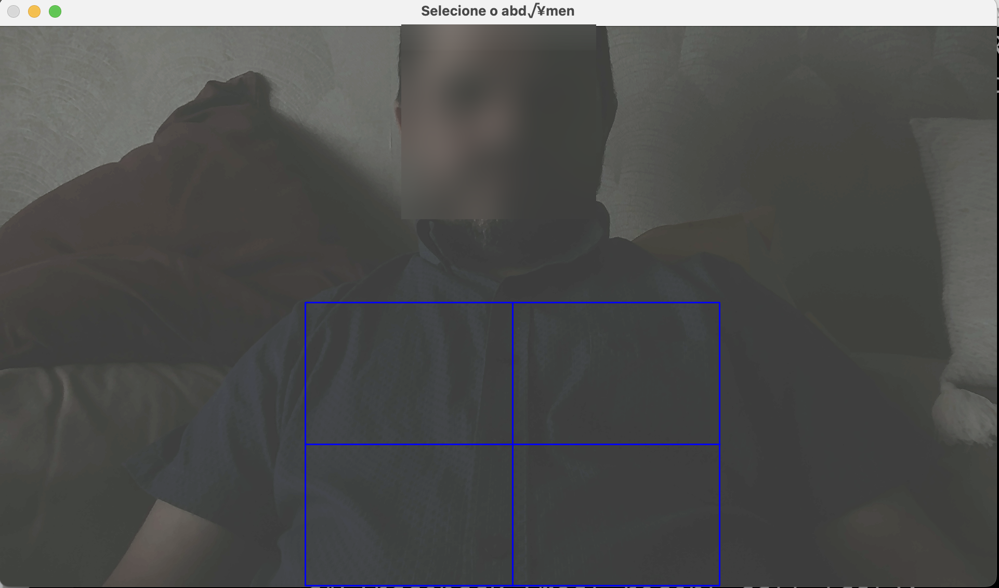
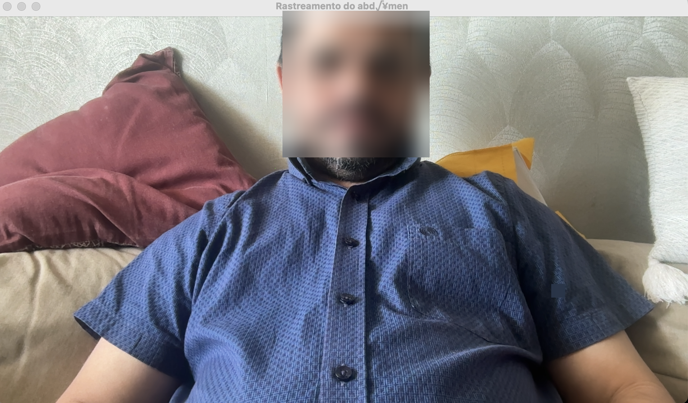
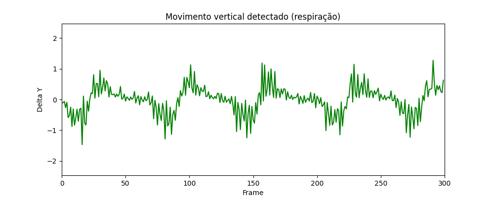

# Respiratory Movement Tracking using Classical Computer Vision

This repository contains a simple proof-of-concept to detect respiratory movements through video tracking of the abdominal region. No AI models were used. The method relies entirely on classical computer vision and signal processing techniques, making it suitable for low-power hardware such as the Raspberry Pi Zero.

## 📸 Experiment Overview

The experiment was inspired by the work of Prof. Pedro Pedrosa, Prof. Mauro Oliveira, and the Salvus team. Their dedication to health monitoring using technology motivated me to test how classical methods could be applied to monitor breathing—one of the vital signs—in a lightweight and accessible way.

For us researchers, it's rewarding to see that our work can help improve people’s quality of life.

## 🔧 How It Works

- A video of a seated person breathing normally was recorded using a standard webcam.
- A Region of Interest (ROI) was manually selected over the abdominal region.
- Optical flow (Lucas-Kanade) was applied to track feature points across the video.
- The average vertical displacement (delta Y) of the tracked points was calculated over time.
- The result is a time series of vertical movement, which correlates with breathing cycles.

## 🧠 No AI Involved

> **NO AI MODELS were involved** — no training, no pose estimation, no deep learning.  
Just classical techniques.

Because of that, this technique can be implemented on constrained hardware like a Raspberry Pi Zero, requiring minimal resources.

## 🖼️ Methodology

### ROI Selection

The user selects the region of interest (ROI) to focus on the abdominal movement:



### Tracking in Action

Tracked points are monitored across frames using the Lucas-Kanade optical flow algorithm:



## 📊 Results

The vertical displacement of the abdominal region across 300 frames (recorded at 30 FPS = 10 seconds) is shown below:



**Observation**: 5 clear peaks can be identified, corresponding to 5 breathing cycles in 10 seconds → **30 breaths per minute**.  
This value is within the upper range for healthy adults at rest.

| Parameter | Value |
|----------|-------|
| Duration | 10 seconds |
| FPS      | 30     |
| Frames   | 300    |
| Peaks    | 5      |
| Estimated BPM | 30  |

## 🧪 Requirements

```bash
pip install opencv-python numpy matplotlib
```

## ▶️ How to Run the Code

1. Connect a webcam or use a pre-recorded video.
2. Run the Python script:
    ```bash
    python respiratory_tracking.py
    ```
3. A window will open showing the camera feed. Use your mouse to select the **abdomen** region on the screen.
4. The script will track that region, compute the vertical displacement, and finally display a plot with the respiration signal.

## 📂 Files

- `respiratory_tracking.py` — Main tracking script
- Example images: `anon_face.jpeg`, `anon_face_2.jpeg`
- Graph result: `Figure_13.png`

## 📄 License

This code is intended for educational and experimental use only.
